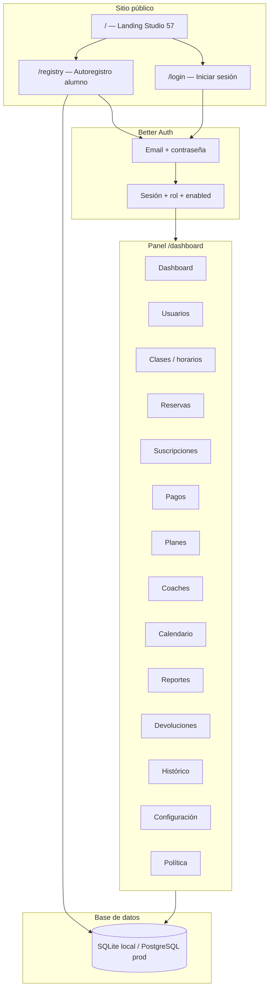
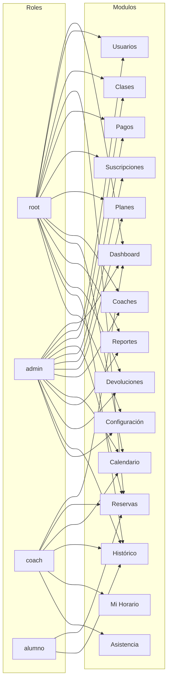
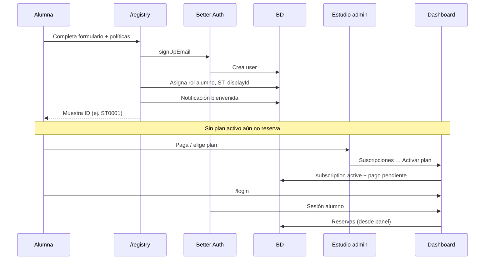

# Flujos y módulos — Pilates Reformer (Studio 57)

Documentación visual de lo implementado en `appstract/pilates-reformer`.

---

## 1. Mapa general de la plataforma



---

## 2. Roles y módulos del dashboard

La visibilidad real depende de **rol + permisos de navegación** (`studio_policy.nav_permissions`). Root puede tener todo si los permisos están activos.



| Rol | Módulos típicos |
|-----|-----------------|
| **root** | Dashboard, Usuarios, Clases, Reservas, Pagos, Suscripciones, Planes, Coaches, Calendario, Reportes, Devoluciones, Histórico, Configuración |
| **admin** | Igual que root (según permisos nav) |
| **coach** | Dashboard, Reservas, Calendario, Histórico, Mi Horario, Asistencia |
| **alumno** | Reservas, Histórico |

---

## 3. Flujo alumno — registro y acceso



> **Nota:** `/agendar` público **aún no existe** en este repo. El registro enlaza ahí, pero la reserva hoy es vía **dashboard → Reservas** (admin crea reserva por ID o alumno con acceso).

---

## 4. Flujo operativo admin — alta completa de alumna

```mermaid
flowchart TD
  A([Admin / Root]) --> B{Alumna nueva}

  B -->|Autoregistro| C[/registry]
  B -->|Alta manual| D[Usuarios → Nuevo alumno]

  C --> E[Usuario + ID ST]
  D --> E

  E --> F[Planes → catálogo de planes]
  F --> G[Suscripciones → Activar / Renovar]
  G --> H[(subscription active)]
  G --> I[(payment pendiente)]

  I --> J{Forma de cobro}
  J -->|Transferencia / efectivo| K[Pagos → Registrar pago]
  J -->|Stripe| L[Pendiente integración pública]
  K --> M[(payment paid)]

  H --> N[Clases → Horario semanal]
  N --> O[Reservas → Nueva reserva por displayId]
  O --> P[(booking confirmed)]
  P --> Q[Coach → Asistencia]
  P --> R[Histórico / Reportes]
```

---

## 5. Módulos del dashboard y acciones disponibles

```mermaid
flowchart TB
  ROOT((Pilates Reformer))

  ROOT --> SITIO[Sitio público]
  SITIO --> S1[Landing /]
  SITIO --> S2[Registry /registry]
  SITIO --> S3[Login /login]

  ROOT --> USR[Usuarios]
  USR --> U1[Crear alumno]
  USR --> U2[Editar / inhabilitar]
  USR --> U3[Reset contraseña]
  USR --> U4[Detalle + plan]

  ROOT --> CCH[Coaches]
  CCH --> C1[CRUD coach]
  CCH --> C2[Mi horario]
  CCH --> C3[Asistencia]

  ROOT --> CLS[Clases]
  CLS --> CL1[Slots semanales]
  CLS --> CL2[Activar / editar / borrar]

  ROOT --> PLN[Planes]
  PLN --> P1[CRUD planes]
  PLN --> P2[class_pack / monthly / add_on]

  ROOT --> SUB[Suscripciones]
  SUB --> SU1[Activar]
  SUB --> SU2[Renovar]
  SUB --> SU3[Cambiar estado]

  ROOT --> PAY[Pagos]
  PAY --> PA1[Registrar pago manual]

  ROOT --> RES[Reservas]
  RES --> R1[Crear por ID]
  RES --> R2[Cancelar]
  RES --> R3[Elegibilidad]

  ROOT --> DEV[Devoluciones]
  DEV --> D1[Crear devolución]

  ROOT --> CAL[Calendario]
  CAL --> CA1[Eventos del estudio]

  ROOT --> REP[Reportes]
  REP --> RE1[KPIs periodo]
  REP --> RE2[Clases del periodo]

  ROOT --> CFG[Configuración]
  CFG --> CF1[Políticas]
  CFG --> CF2[Alertas]
  CFG --> CF3[Mensajes]
  CFG --> CF4[Permisos nav]

  ROOT --> HIS[Histórico]
  HIS --> H1[Reservas pasadas]
```



### Acciones por módulo (server actions)

| Módulo | Acciones |
|--------|----------|
| **Registry** | `hiddenRegistryAction` |
| **Usuarios** | crear, editar, inhabilitar, reset password, eliminar |
| **Coaches** | crear, editar, inhabilitar, reset password, eliminar |
| **Clases** | crear slot, editar, borrar, toggle activo |
| **Planes** | crear, editar, toggle, eliminar |
| **Suscripciones** | activar, renovar, cambiar estado |
| **Pagos** | registrar pago |
| **Reservas** | crear, cancelar, elegibilidad |
| **Devoluciones** | crear devolución |
| **Calendario** | crear, editar, eliminar evento |
| **Configuración** | guardar config, permisos nav |

---

## 6. Flujo coach — día de clase

```mermaid
flowchart LR
  C([Coach]) --> L[/login]
  L --> D[Dashboard]
  D --> MH[Mi Horario]
  D --> R[Reservas del día]
  R --> A[Asistencia]
  A --> DB[(booking.attended)]
  D --> H[Histórico]
  D --> CAL[Calendario]
```

---

## 7. IDs de usuario (ST)

```mermaid
flowchart TD
  REG[/registry o Usuarios] --> ST["ST0001, ST0002…"]
  ST --> RES[Reservas / login panel]
  PLAN[Plan class_pack / monthly] --> ST
```

| Prefijo | Tipo | Ejemplo |
|---------|------|---------|
| **ST** | Alumno | ST0001, ST0002 |

---

## Resumen — implementado vs pendiente

| Área | Estado |
|------|--------|
| Landing + secciones contenido | ✅ |
| Registro `/registry` | ✅ |
| Login + dashboard por roles | ✅ |
| CRUD usuarios, coaches, clases, planes | ✅ |
| Suscripciones, pagos, reservas, devoluciones | ✅ |
| Reportes, calendario, config, permisos nav | ✅ |
| Reserva pública `/agendar` | ❌ no implementada |
| Login por ID (solo email hoy) | ⚠️ parcial |

---

## Usuario demo local

| Email | Contraseña | Rol |
|-------|------------|-----|
| `operador@demo.pilates.mx` | `demo-root-99` | root |

Requiere `DB_DRIVER=sqlite` en `.env` y usuario creado en `local.db`.
